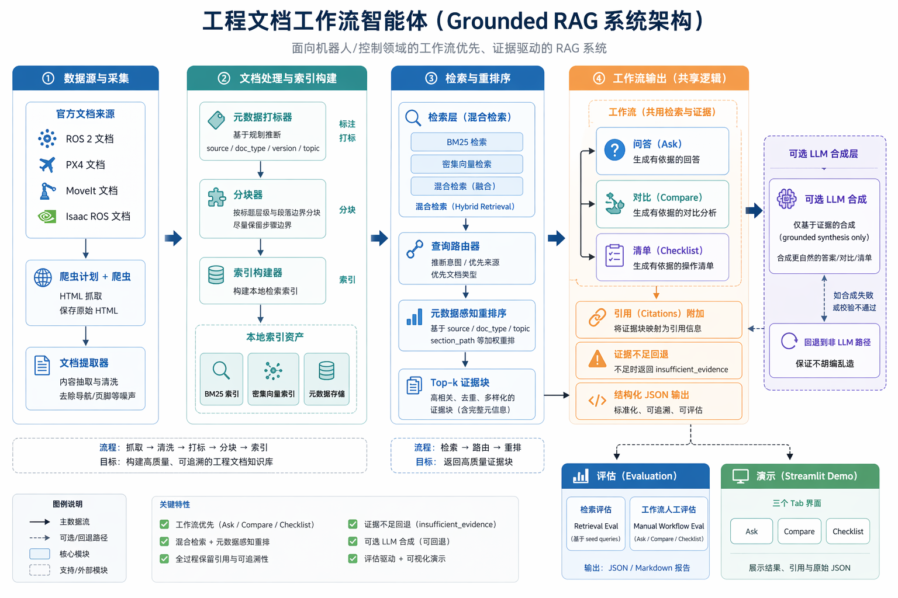
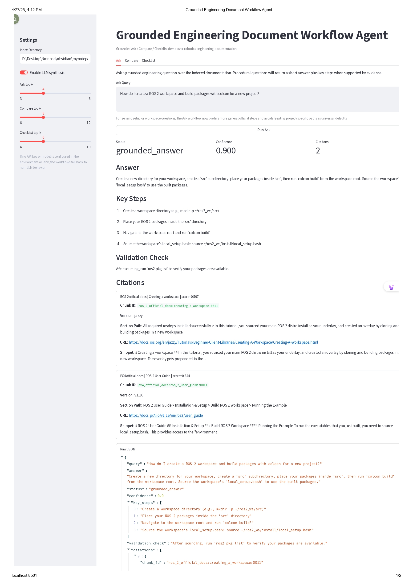
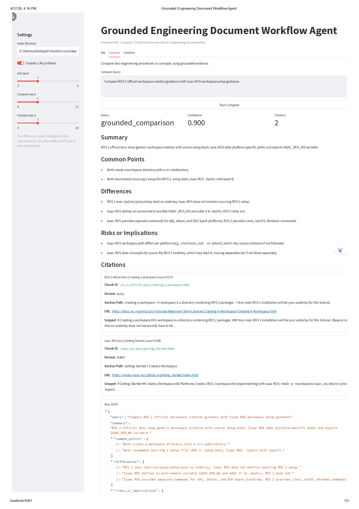
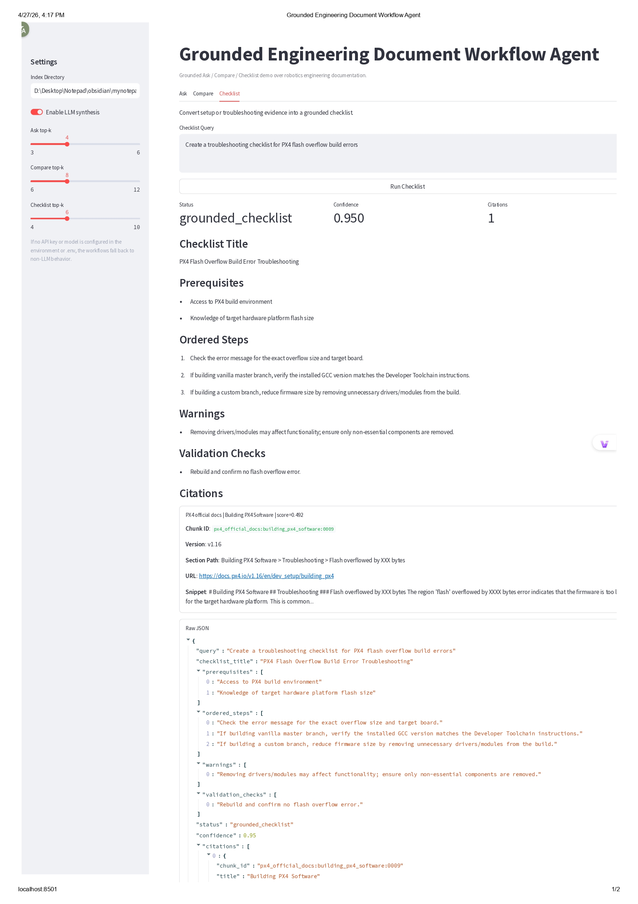

# Grounded Engineering Document Workflow Agent

一个面向工程文档的工作流式 RAG 项目，聚焦机器人文档场景，当前支持：

- Grounded Q&A
- 文档 / 流程 Compare
- Checklist Extraction

项目目标不是做自由式智能体，而是做一个结构清晰、可调试、可演示、适合作品集展示的工程化 AI workflow 系统。

## 项目概述

当前 MVP 主要覆盖以下官方文档：

- ROS 2 official docs
- PX4 official docs
- MoveIt docs
- Isaac ROS docs

当前本地语料规模：

- 4 个官方文档源
- 29 篇处理后文档
- 450 个检索 chunk
- 9 条手动 workflow 评测样例

## 系统架构



系统采用显式流水线，而不是自由规划式 agent：

1. 文档抓取
2. 正文提取与清洗
3. 元数据打标
4. 文档分块
5. 检索索引构建
6. 混合检索与重排
7. Ask / Compare / Checklist 工作流
8. 可选 LLM grounded synthesis
9. 评测与 Demo

核心目录：

- `app/ingestion/`：抓取、抽取、打标、分块
- `app/retrieval/`：BM25、dense、hybrid、query routing、reranking
- `app/workflows/`：`ask.py`、`compare.py`、`checklist.py`
- `app/prompts/`：grounded prompt 模板
- `app/models/`：结构化输出 schema
- `app/ui/demo.py`：Streamlit Demo
- `scripts/`：数据处理、测试、评测脚本

## 真实实现流程

当前真实已实现的主链路是：

`crawl_plan -> raw HTML -> cleaned documents -> tagged documents -> chunks -> local index -> hybrid retrieval -> routing/reranking -> workflow output -> citations`

对应产物：

- `data/raw/`：原始 HTML
- `data/processed/documents.jsonl`：清洗后文档
- `data/processed/tagged_documents.jsonl`：打标后文档
- `data/processed/chunks.jsonl`：检索 chunk
- `data/index/`：BM25 / dense / metadata / manifest

## 检索与 Groundedness 设计

检索层当前使用：

- BM25
- dense retrieval（TF-IDF + TruncatedSVD）
- hybrid retrieval
- rule-based query routing
- metadata-aware reranking

保留的核心 metadata：

- `title`
- `source`
- `version`
- `section_path`
- `url`
- `score`
- `snippet`

Groundedness 约束：

- 先检索，后生成
- Ask / Compare / Checklist 都只基于检索证据输出
- citations 直接绑定真实 chunk
- 证据不足时返回 `insufficient_evidence`
- 不允许无依据扩写

## 三个工作流

### 1. Ask

输入一个工程问题，输出：

- `query`
- `answer`
- `status`
- `confidence`
- `citations`

特点：

- 走现有 hybrid retrieval
- 支持非 LLM 抽取式 baseline
- 支持可选 LLM grounded synthesis

### 2. Compare

输入一个比较问题，输出：

- `query`
- `summary`
- `common_points`
- `differences`
- `risks_or_implications`
- `status`
- `confidence`
- `citations`

特点：

- 支持 `Compare A and B / with / vs / versus`
- 先解析比较目标，再检索双边证据
- 支持 rule-based compare baseline
- 支持可选 LLM grounded compare synthesis

### 3. Checklist

输入一个 setup / troubleshooting / procedure 相关请求，输出：

- `query`
- `checklist_title`
- `prerequisites`
- `ordered_steps`
- `warnings`
- `validation_checks`
- `status`
- `confidence`
- `citations`

特点：

- 可直接接收 query，也可接收 evidence set
- 优先 procedural / setup / troubleshooting 证据
- 先走规则式 checklist baseline
- 再可选接 LLM grounded synthesis

## 有无 LLM 的区别

这个项目的一个重点是：**没有 LLM 也能工作**。

### 不开 LLM

系统仍然可以完成：

- 混合检索
- reranking
- citations
- insufficient-evidence fallback
- Ask / Compare / Checklist 的基础 grounded 输出

这适合：

- 本地调试
- 稳定演示
- 展示非 LLM baseline

### 开启 LLM

LLM 只用于**最终 grounded synthesis**，不参与：

- 抓取
- 清洗
- 分块
- 索引构建
- 检索
- reranking

也就是说，LLM 是可选增强层，不是系统前提。

项目支持从系统环境变量或根目录 `.env` 读取配置。  
例如使用 DeepSeek：

```env
GROUNDED_QA_LLM_API_KEY=your_api_key
GROUNDED_QA_LLM_MODEL=deepseek-chat
GROUNDED_QA_LLM_BASE_URL=https://api.deepseek.com

GROUNDED_COMPARE_LLM_API_KEY=your_api_key
GROUNDED_COMPARE_LLM_MODEL=deepseek-chat
GROUNDED_COMPARE_LLM_BASE_URL=https://api.deepseek.com

GROUNDED_CHECKLIST_LLM_API_KEY=your_api_key
GROUNDED_CHECKLIST_LLM_MODEL=deepseek-chat
GROUNDED_CHECKLIST_LLM_BASE_URL=https://api.deepseek.com
```

## 评测

### 检索评测

已有检索评测资产：

- `data/eval/seed_queries.json`
- `scripts/run_retrieval_eval.py`
- `data/eval/retrieval_eval_results.json`
- `data/eval/retrieval_eval_results.md`

### Workflow 手动评测

已有 workflow 手动评测资产：

- `data/eval/manual_eval_set.json`
- `scripts/run_manual_eval.py`
- `data/eval/manual_eval_report.json`
- `data/eval/manual_eval_report.md`

当前手动评测集包含：

- Ask：3 条
- Compare：3 条
- Checklist：3 条

当前本地非 LLM 批量跑通结果：

- 9 / 9 返回 grounded 输出

## Demo

项目包含一个轻量 Streamlit demo：

- `app/ui/demo.py`

功能：

- 三个 tab：`Ask`、`Compare`、`Checklist`
- 展示结构化输出
- 展示 citations
- 支持开关 LLM synthesis

### 界面截图

#### Ask Demo



#### Compare Demo



#### Checklist Demo



### 演示视频

GitHub 上最稳定的方式是直接提供仓库内视频链接：

- [点击查看演示视频](video/demo.webm)

如果当前 GitHub 页面支持内嵌视频预览，也可以直接查看下面这个播放器：

<video src="video/demo.webm" controls width="100%"></video>

运行方式：

```bash
streamlit run app/ui/demo.py
```

## 快速运行

### 数据处理链路

```bash
python scripts/crawl_docs.py
python scripts/extract_docs.py
python scripts/tag_docs.py
python scripts/build_chunks.py
python scripts/build_index.py
```

### Workflow 测试

```bash
python scripts/test_grounded_qa.py "What is NITROS in Isaac ROS?"
python scripts/test_compare.py "Compare MoveIt and Isaac ROS"
python scripts/test_checklist.py "Create a troubleshooting checklist for PX4 flash overflow build errors"
```

### 手动评测

```bash
python scripts/run_manual_eval.py --disable-llm --log-level INFO
```

## 项目亮点

这个项目适合作品集展示的原因在于：

- 不是单纯 prompt 工程，而是完整 workflow 系统
- 有真实文档 ingestion / retrieval / reranking / grounding 链路
- Ask / Compare / Checklist 三个任务都已落地
- citations 和 insufficient-evidence fallback 都已实现
- 同时支持非 LLM baseline 和 LLM 增强版
- 结构清晰，适合在面试里讲系统设计与工程权衡

## 当前限制

- 当前语料仍然是首批高价值页面，不是全站规模
- 手动评测集较小，主要用于 demo 和人工 review
- 还没有部署 API
- checklist 和 compare 仍然保持了 MVP 风格的简洁实现
